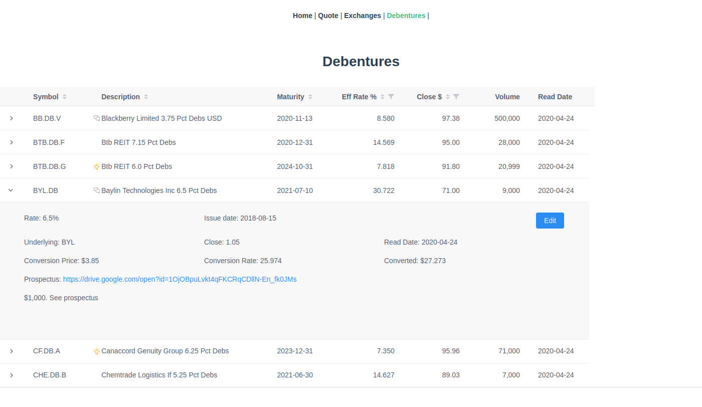

# Spring Boot - VueJs - H2

A platform independent "stand-alone" application?

## Wish list:

* a gui "desktop" application that can be run on Linux or Windows machines
* use common technologies 
* simple to launch

## The experiment

* Spring Boot REST server
* H2 SQL database (no server, flat file persistence, like SQLite but Java based)
* VueJs as SPA web gui (html, js, css)

## Inspirations

* [pgAdmin4](https://www.pgadmin.org/): a web-based PostgreSQL admin client which when launched fires up a server and opens a web page

* [Example maven project](https://github.com/jonashackt/spring-boot-vuejs): bundles the frontend npm build with the backend maven build for a single deployment artifact

## Other options considered

* The full-blown client-server application:
  * Spring Boot client
  * PostgresSQL db server
  * VueJs SPA web client
  * Solr search

  If not deploying in a cloud environment (i.e. running as a private individual), there were too many moving parts to fire up and actually use the application

* The Docker version:
  * compose multiple docker images of the full-blown client-server application so they can be fired up together

  Too complicated for a desktop appication. To share the app, others need to install Docker. Need to map Docker shares to the host OS file system.

* [Electron](https://www.electronjs.org/)
  This looks like what I really want. Might be the proper solution. There are some great apps like [Postman](https://www.postman.com/) built on Electron. All Javascript. Embeds [Nodejs](https://nodejs.org) webserver and Chrome engine.  But... it was just too complicated to get working
  * I could develop on Linux, but on Windows not (spent too many hours reading issue trackers for this)
  * Trying to add a database like SQLite was too difficult. Also, no nice javascript relational db apis (probably should not use a relational db with this approach, but I want to use sql reporting tools).
  * I tried with [SELTE](https://svelte.dev/), but perhaps that was just adding one too many new technologies

* Others: Java Swing, JavaFx, GTK, Qt, Python libs: Do I really want to go down those paths? Python was an almost, but for the gui, I backed out to standard web-based technologies.

## The hope

When I need to build a little utility and would like to wrap it in a gui, I can grab a template like this as a starter?

## Debenture Screenshot

(requires data loaded)
